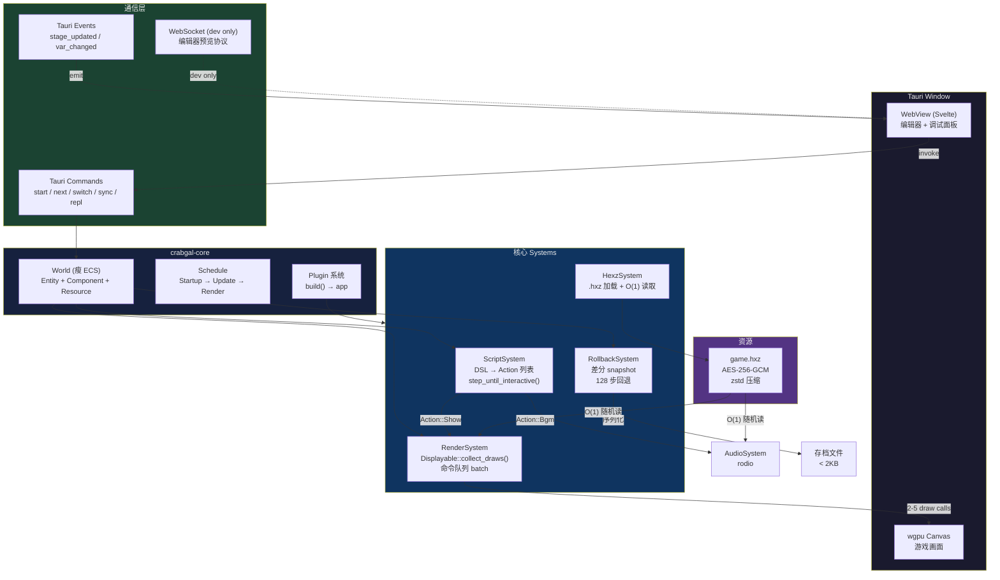
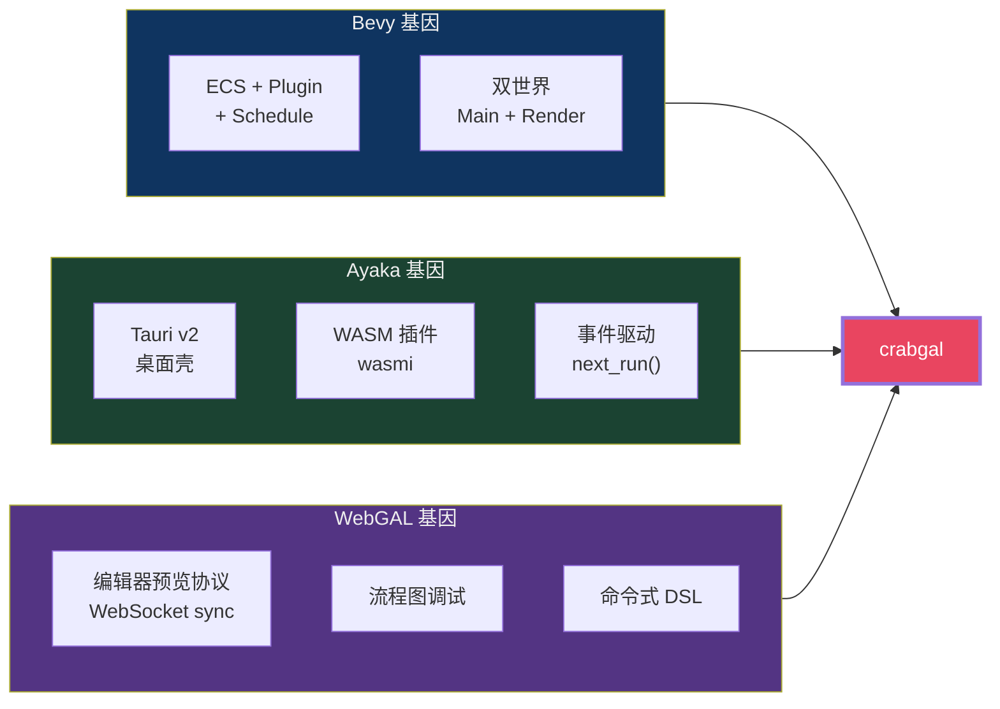

# crabgal

基于 Rust 瘦 ECS + wgpu + Tauri/Svelte 的视觉小说引擎，借鉴 Bevy、Ayaka、WebGAL 的架构精华。

## 阅读顺序

1. [语言与技术栈](./dev/docs/01-language-and-stack.md)
2. [ECS 架构](./dev/docs/02-ecs-architecture.md)
3. [渲染管线](./dev/docs/03-render-pipeline.md)
4. [存档与回退](./dev/docs/04-rollback-and-save.md)
5. [脚本 DSL](./dev/docs/05-script-dsl.md)
6. [资源打包 (hexz)](./dev/docs/06-hexz-packaging.md)
7. [行业参考](./dev/docs/07-references.md)

## 最小原型

## 三个基因

## 技术栈

Rust 瘦 ECS + 自定义 DSL + wgpu + Tauri v2 + Svelte 5 + hexz 打包

## 目标

- 二进制 < 8MB
- 存档 < 2KB
- 60fps (2-5 draw calls)
- 冷启动 < 500ms
- 脚本热重载 < 50ms
