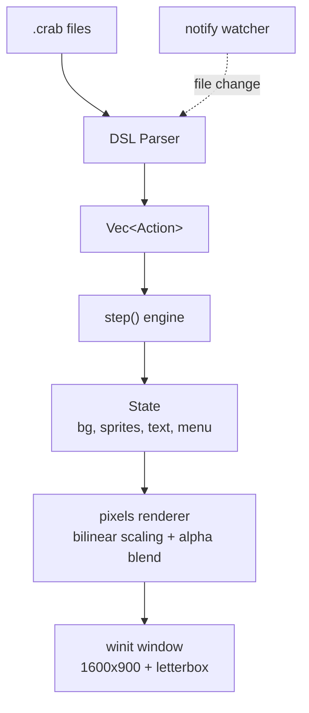

# crabgal

A visual novel engine built with Rust, pixels, and winit.

## Quick Start

```bash
# Check script syntax
cargo run -- check path/to/scene.crab

# Run in dev mode (hot reload, windowed preview)
cargo run -- dev path/to/project/
```

## Script Format

`.crab` files use a simple command-based DSL:

```
label start

bg alley_day fade
show eileen chr/happy.png at left slide
say Eileen: Welcome to the world.
say Eileen: This is a visual novel engine.

menu "What next?": "Continue" -> next, "Exit" -> quit

label next
bg night fade
```

## Architecture

```
crabgal/
├── crates/
│   ├── crabgal-core     State machine, Action system, step execution
│   └── crabgal-script   .crab parser, hot-reload file watcher
└── crabgal-cli          CLI: dev / check commands, rendering
```



## Features

- **Hot reload** — edit `.crab` files, changes apply instantly (F5 to force)
- **Design resolution** — 1600x900 virtual canvas, automatic letterbox scaling
- **Anti-aliased** — bilinear interpolation for all image scaling
- **Vector text** — ab_glyph font rendering, CJK support
- **Typewriter effect** — configurable text reveal speed
- **Sprite transitions** — slide, fade, instant enter/exit animations
- **Menu system** — clickable choices with jump targets

## Tech Stack

Rust | pixels (wgpu) | winit | ab_glyph | image | notify

## Project Structure

Each VN project is a directory:

```
my-game/
├── scripts/
│   ├── main.crab
│   └── scene01.crab
└── assets/
    ├── background/
    └── figure/
```

## Goals

- Binary &lt; 8MB
- Save files &lt; 2KB
- 60fps rendering
- Cold start &lt; 500ms
- Script hot reload &lt; 50ms
