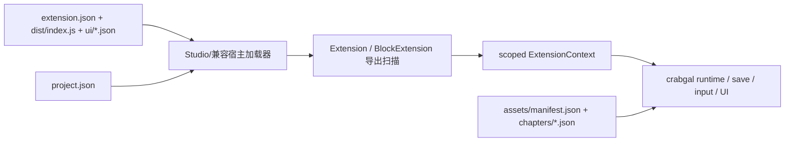

# LetsGal Studio 1.7.0 扩展 API 兼容性参考

> 状态：2026-07-18 本机 1.7.0 实测基线。工程 adapter 已按本文基线接入；本文仍作为外部格式与
> 扩展 ABI 的证据记录，具体实现边界见
> [`08-letsgal-studio.md`](../architecture/08-letsgal-studio.md)。

这份文档面向下一位接手 crabgal 兼容工作的 Codex。目标不是复刻 LetsGal Studio 编辑器，而是让另一套运行时能够加载 Studio 扩展，并为扩展提供足够一致的 `@avg-studio/sdk` / `ExtensionContext` 行为。

## 0. 结论先行

当前应以 **LetsGal Studio 1.7.0 + SDK 1.0.0** 为兼容基线，而不是旧 `avg.renderer`。

1.7.0 仍未提供 editor cursor、run interception 或 preview backend API。当前公开
`ExtensionContext` 保持运行时取向；`FlowAPI` 提供 `signal` 与 `callFragment()`，但它们不能
替代编辑器调试合同。crabgal 不再把 `getHost()`、DOM 或 Electron 能力当作 SDK。

一个最小可用兼容层至少要实现：

1. 读取 `extension.json`，按 `entry` 加载 ESM bundle；
2. 给 bundle 提供单实例 `react`、`react-dom`、JSX runtime 和 `@avg-studio/sdk`；
3. 扫描 bundle 导出的 `Extension` / `BlockExtension` 子类；
4. 实现 `ExtensionContext` 的 22 个字段（20 个命名空间，加 `subscribe`、`getHost`）；
5. 支持 `method()`、`settings()`、`defineSave()`、系统插槽、输入动作与 UI scope；
6. 读取 Studio 发行包的 `config.json`、`assets/manifest.json`、章节文件和扩展清单。

1.6.1 相比 1.6.0 的公开 ABI 有两处必须纳入的源码级新增：

- `ctx.story`：只读完整剧本；
- `INTERNAL_SYSTEM_SLOT.Input = "internal.system.input"`：第 7 个、且为必需的系统槽位。



## 1. 基线与证据等级

### 1.1 版本矩阵

| 对象 | 版本/提交 | 结论 |
|---|---|---|
| 本机当前安装 | Studio 1.7.0 | 主基线 |
| 前一实测稳定版 | Studio 1.6.3 | 用于宿主行为差异对照 |
| 本机旧对照包 | Studio 1.6.2 | 用于 SDK 字节级差异 |
| 已校验的历史包 | `Studio-1.6.3-mac.zip` | 保留历史 SHA-256 证据 |
| 扩展 SDK | `SDK_VERSION = "1.0.0"` | Studio 版本与 SDK 主版本不是同一个版本号 |
| `avg.renderer` | `d69d1681fe07e6273f99ed329fb01503cb3f3394`，2020-08-31 | 仅作历史语义参考 |
| `avgplus-asarmor` | `3a95e627831268207b5da81310c5e9f4e4e1829b`，2025-01-26 | 仅用于判断 ASAR 保护方式 |

官网更新 manifest：<https://static-lg-studio.cn-gd.ufileos.com/studio/latest-stable.json>

历史 1.6.3 官方包实测 SHA-256：

```text
1f8ca44870142f222e25034297f436477d12cc202e229840251ab7402ca3c661
```

本机 1.7.0 的 `dist/sdk/constants.ts` 仍声明 `SDK_VERSION = "1.0.0"`。当前
`FlowAPI` 含 `signal`、`callFragment()`、`goToFragment()` 和 `restart()`；
`ExtensionContext` 仍没有编辑器/preview backend 命名空间。因此不应制造
`SDK 1.7.0` 这个不存在的版本号，也不能把宿主私有对象当作新增 SDK。

### 1.2 证据标记

本文结论按以下优先级排列：

| 标记 | 来源 | 可信度 |
|---|---|---|
| **T** | 1.7.0 本机发行包内未压缩的 SDK TypeScript 源码 | 当前公开类型合同 |
| **R** | 1.7.0 renderer/player 实际加载器和 runtime bundle | 当前实际行为 |
| **B** | 用 Studio 自己的发行链生成并运行探针扩展 | 端到端行为 |
| **D** | [官方扩展文档](https://docs.avg-engine.com/extensions/api-context) | 设计意图；有少量滞后/矛盾 |
| **H** | 旧 `avg.renderer` 与相关仓库 | 历史背景，不是当前合同 |

文档站共核对了 34 个扩展/API 页面。凡是 **T/R/B** 与 **D** 冲突，本文以实际代码和发行实测为准，并单独指出差异。

## 2. 兼容边界

### 2.1 应兼容什么

- 扩展包目录与 `extension.json`；
- ESM 程序扩展；
- 纯可视化 UI 扩展和混合扩展；
- `Extension`、`method()`、`settings()`、`defineSave()`；
- 仍被 1.6.1 加载器支持但文档弱化的 `BlockExtension`；
- `ExtensionContext`；
- 系统插槽、输入动作、快捷键格式；
- Studio 1.6.1 的工程配置和发行数据协议。

### 2.2 不应当成兼容合同的东西

- `ctx.getHost().application` 等内部对象；
- Studio 自身的 Electron IPC（如 `build:start`）；
- 当前 renderer 的 Zustand store、React 组件名、minified 函数名；
- Node/Electron 的 `require` 全局；
- 旧 `avg.renderer` 的 `flow.wait()`、`text.show()` 等 sandbox 全局；
- ASAR 的文件布局和反提取细节。

## 3. 扩展包与 manifest

### 3.1 三种扩展形态

```text
# 纯可视化 UI
my-extension/
├── extension.json       # 不写 entry
└── ui/
    └── main-panel.json

# 程序或混合扩展
my-extension/
├── extension.json       # 写 entry
├── ui/                  # 可选
├── src/                 # 只在开发目录存在
├── sdk/                 # Studio 同步的 SDK 本地副本
└── dist/
    └── index.js         # Studio/Player 实际加载
```

发行包只复制运行所需的清单、`entry`、UI 文档及必要资源，不复制 `src/`、本地 SDK 或完整开发依赖。

### 3.2 `ExtensionManifest` 实际形状

```ts
type BuiltinComponentId = "DialogueBox" | "Choice" | "InputBox";
type ExtensionRiskTier = "safe" | "standard" | "privileged";

interface ExtensionManifest {
  id: string;
  name: string;
  author: string;
  version: string;
  entry: string;                 // 归一化后默认 dist/index.js
  sdkVersion: string;

  description?: string;
  hasProgram?: boolean;          // 校验器生成；不要手写
  icon?: string;
  propsSchema?: Record<string, PropsSchemaField>;
  overrides?: BuiltinComponentId[];
  builtin?: boolean;
  permissions?: string[];
  network?: { domains?: string[] };
  riskTier?: ExtensionRiskTier;
  minHostVersion?: string;
}

interface PropsSchemaField {
  type: "string" | "number" | "boolean" | "enum";
  default?: unknown;
  description?: string;
  options?: string[];            // enum 必需且非空
}
```

关键实际规则（T/R）：

- `id` 长度 2～128，正则为 `^[^\s/\\:*?"<>|\x00-\x1f]{2,128}$`。它**允许中文、点、下划线和大小写**；公开文档里“必须 `<author>.<name>` 小写”的描述不是校验器真实限制。
- `entry` 缺省归一化为 `dist/index.js`。
- 原始 JSON 是否显式包含非空 `entry` 决定 `hasProgram`；没有 `entry` 即纯资源/纯 UI 扩展。
- `author` 可以缺失，归一化为 `""`。
- `builtin: true` 只允许 `avg.internal.*` id。
- `permissions`、`network`、`riskTier` 在 1.6.1 只校验形状；**没有权限 gating**。
- `sdkVersion` 虽写成 semver range，但兼容判断实际只提取第一个数字并比较 major。当前 major 为 1，`^1.0.0`、`>=1.0.0`、`1.7` 都通过，`>=2` 不通过。
- `overrides` 不允许重复，只接受三个内置组件名；程序还需导出同名 React 组件映射。

### 3.3 入口构建约束

Studio 生成的 Vite 配置使用 ESM library mode，并 externalize：

```ts
[
  "react",
  "react-dom",
  "react/jsx-runtime",
  "react/jsx-dev-runtime",
  "@avg-studio/sdk",
]
```

模板的主要约束：ES2020、ESNext module、`moduleResolution: "bundler"`、React 18、Vite 5、输出 `dist/index.js`、不压缩、带 sourcemap。

## 4. 实际 ESM 加载 ABI

### 4.1 宿主注入

Studio 1.6.1 在 renderer 中创建：

```ts
window.__avgRuntime = {
  React,
  ReactDOM,
  ReactJsxRuntime,
  ReactJsxDevRuntime,
  Sdk,
};
```

加载器获取扩展 bundle 文本后，用正则把以下**静态 import** 改写为对 `window.__avgRuntime` 的引用：

| import specifier | 注入对象 |
|---|---|
| `react` | `React` |
| `react-dom` | `ReactDOM` |
| `react/jsx-runtime` | `ReactJsxRuntime` |
| `react/jsx-dev-runtime` | `ReactJsxDevRuntime` |
| `@avg-studio/sdk` | `Sdk` |

随后把改写文本放进 `Blob(type="application/javascript")`，用动态 `import(blobUrl)` 执行，成功后缓存模块。

兼容层应直接用真正的 ESM linker/import map 完成同样目标，不必复刻脆弱的正则。但为了加载现有产物，应满足这些事实：

- 以上依赖必须是宿主单实例；
- bundle 应是单文件或所有相对依赖都已打包，因为 Blob URL 不能自然解析扩展目录里的相对模块；
- 当前改写器只处理单行、行首的静态 `import`；不处理 `export ... from` 或动态 import 的这些 bare specifier；
- loader 还补了一个极小 `process` shim（`env.NODE_ENV`、`nextTick`、`platform`、`versions` 等）；
- Studio 内部随机端口 HTTP server 以 `/extensions/<encoded-id>/...` 提供文件，并在 JS 前注入 `__AVG_STUDIO_EXTENSION_BASE_URLS__[id]`。

这些全局名属于 **R 级内部 ABI**，扩展不应直接依赖；兼容层只需保证正常 import 行为。

### 4.2 导出扫描

运行时递归扫描 default export、所有 named exports 以及数组中的值：

- `Extension` 子类；
- `BlockExtension` 子类；
- bundle 顶层的旧式导出：`onRegister`、`settingsSchema`、`overrides`、`visualUI`。

如果三类注册结果（UI、block、module）全为空，加载失败：

```text
扩展 bundle "<id>" 没有导出 Extension / BlockExtension 子类
```

一个 bundle 可以导出多个 `Extension` 子类。default export 若是 UI `Extension`，它也是 `loadExtensionClass()` 的首选；否则选择第一个可渲染模块。

### 4.3 模块归一化

对每个 `Extension` 子类：

- `uiId = meta.id ?? kebabize(class.name)`；
- `label`、`autonomous`、`supportsSlot` 从 `meta` 复制到旧字段；
- `settings()` 品牌对象被展开为 `settingsSchema` builder；
- `meta.exposeUI === false` 时，即使实现 `render()` 也不注册为程序 UI；
- 类有 `render()` 且未隐藏时，进入“显示界面”候选；
- 静态 `method()` 与 `BlockExtension.type` 共用 `<extension-id>/<local-type>` 命名空间，重复立即报错。

## 5. `Extension`、方法、设置与存档

### 5.1 `Extension` 基类

```ts
interface ExtensionProps { readonly id?: string }
interface ExtensionRenderData<P extends ExtensionProps> {
  component: React.FC<P>;
  props: P;
}

abstract class Extension<P extends ExtensionProps = ExtensionProps> {
  static readonly extensionKind = "module";
  static meta?: BrandedExtensionMeta;
  static settings?: BrandedExtensionSettings;
  static saveSchema?: SaveSchema;
  static onRegister?(ctx: ExtensionContext): void | Promise<void>;

  protected data?: P;
  protected get context(): ExtensionContext;
  readonly save: SaveAPI<...>;
  get id(): string;
  close(): void;

  onInit?(): void;
  onShow?(): void;
  onClose?(): void;
  render?(): ExtensionRenderData<P>;
}
```

`@extension({...})` 只是 `static meta = meta({...})` 的装饰器语法糖，同时兼容 TC39 stage-3 与 legacy decorator 输出。

```ts
interface ExtensionModuleMeta {
  id?: string;                   // 若显式写，必须 kebab-case
  label?: string;
  description?: string;
  category?: string;
  autonomous?: boolean;
  exposeUI?: boolean;            // 默认 true
  supportsSlot?: string | string[];
}
```

生命周期：

| 钩子 | 次数/时机 |
|---|---|
| `static onRegister(ctx)` | 引擎启动时每个模块一次；与 `autonomous` 无关 |
| `onInit()` | 实例 attach host/save 后、render 前 |
| `onShow()` | UI 可见时 |
| `onClose()` | UI 销毁前 |

`autonomous: true` 的额外效果是启动期自动显示/常驻，而不是决定是否调用 `onRegister`。

### 5.2 scope 的真实边界

这是兼容实现最容易做错的部分：

- scope 主键是 **manifest extension id**，二级 scope 才是模块 `uiId`；
- `ctx.ui.show("panel")` 自动改成 `<extension-id>/panel`；含 `/` 的路径视为绝对路径；
- `ctx.settings.get("field")` 在模块 scope 中读 `<uiId>.field`；包含 `.` 的 key 被视为完整路径，不再补前缀；
- `ctx.input.registerAction()` 强制 action id 以 `<manifest-extension-id>.` 开头，不是以模块 id 开头；
- save 字段实际注册为 `<manifest-extension-id>.<field>`，**没有模块 id**。同一扩展多个模块声明同名 save 字段会共享/冲突，兼容层不应擅自隔离。

### 5.3 `method()`

```ts
interface ExtensionMethodDef<S extends BlockSchema | undefined> {
  title: string;
  description?: string;
  id?: string;                   // 默认由静态属性名 kebabize
  schema?: S;
  run(this: ExtensionBase, ctx: ExtensionContext, params: ParamsOf<S>): void | Promise<void>;
  runImmediately?(this: ExtensionBase, ctx: ExtensionContext, params: ParamsOf<S>): void | Promise<void>;
  skip?(this: ExtensionBase, ctx: ExtensionContext, params: ParamsOf<S>): void | Promise<void>;
}
```

运行模式：

- normal → `run`；
- immediate → `runImmediately ?? run`；
- skip → `skip ?? run`。

每次方法调用都 `new moduleCtor()`，再 attach context/save。不要依赖实例临时字段跨调用持久；持久状态放 `this.save` 或 `ctx.variables`。

`method()` 回调中的 `this` 只能推成 `ExtensionBase`，因此访问声明过的 save 字段时，1.6.1 实际类型需要显式收窄：

```ts
const save = this.save as unknown as SaveAPI<MySaveMap>;
```

官方 `save-schema` 页面有一个未强转的示例，但 SDK 类型和另外两页文档都表明强转才是当前可靠写法。

### 5.4 方法参数 `BlockSchema`

| type | 字段 |
|---|---|
| `string` | `label? default? multiline? required?` |
| `number` | `label? default? min? max? step? required?` |
| `boolean` | `label? default? required?` |
| `enum` | `label? default? options: {label,value}[] required?` |
| `asset` | `label? assetType?: image/audio/video/any required?` |
| `character` | `label? required?` |
| `characterPortrait` | `label? characterField? required?` |
| `scene` | `label? required?` |
| `fragment` | `label? required?` |
| `variable` | `label? required?` |
| `uiExtension` | `label? required?` |

除 `number`、`boolean` 和可推导 literal union 的 `enum` 外，其余参数在 `ParamsOf` 中都落成 `string`。`required` 影响 Studio 表单，但 `ParamsOf` 没把字段变成可选。

### 5.5 未重点文档化但仍可用的 `BlockExtension`

```ts
abstract class BlockExtension<P extends Record<string, unknown>> {
  static readonly extensionKind = "block";
  static readonly type: string;
  static readonly title: string;
  static readonly description?: string;
  static readonly category?: string;
  static readonly schema?: BlockSchema;

  abstract run(ctx: ExtensionContext, params: P): void | Promise<void>;
  runImmediately?(ctx: ExtensionContext, params: P): void | Promise<void>;
  skip?(ctx: ExtensionContext, params: P): void | Promise<void>;
}
```

实际 loader 仍完整注册它。约束：

- `type` 必须匹配 `^[a-z0-9-]+$`；
- 全局 block type 为 `<extension-id>/<type>`；
- 与同 bundle 内所有 `method().id` 不得重复；
- 它没有 `this.save`、模块 settings scope 或 UI 生命周期。

### 5.6 `settings()` builder

```ts
settings((s) => ({
  text: s.string("标签").default("x").multiline().describe("..."),
  count: s.number("标签").default(1).range(0, 10).step(1),
  flag: s.boolean("标签").default(true),
  mode: s.enum("标签", ["a", "b"] as const)
    .labels({ a: "A", b: "B" }).default("a"),
  key: s.shortcut("标签").default("F5"),
  asset: s.asset("标签").accepts("image", "audio", "video", "any"),
  ui: s.uiRef("标签").default("panel"),
}));
```

所有 builder 都支持 `.describe()` 和 `.enabledWhen(key, equals = true)`。`enabledWhen` 只控制 Studio UI 置灰，不修改底层值。

设置保存到：

```text
project.json.extensionSettings[extensionId][key]
```

模块级短 key 自动使用 `<uiId>.` 前缀。Player 的 `ctx.settings.set()` 只改运行时内存，Studio 中才持久化工程。

### 5.7 `defineSave()`

```ts
interface SaveFieldSpec {
  type: "number" | "string" | "boolean" | "list";
  persistence: "slot" | "shared";
  default: unknown;
  label?: string;
}

interface SaveAPI<M> {
  get<K extends keyof M>(key: K): M[K];
  set<K extends keyof M>(key: K, value: M[K]): void;
  useValue<K extends keyof M>(key: K): [M[K], (v: M[K]) => void];
}
```

- `slot` 随存档槽；
- `shared` 写入玩家档案级共享数据；
- `type` 目前是展示分类，不做运行时值校验；
- list 的读取类型是 readonly，必须整体 `set()`，原地 `push()` 不会形成可靠落盘变更。

## 6. `ExtensionContext` 完整合同

### 6.1 顶层形状（1.6.1）

发行探针实测 `Object.keys(ctx).sort()`：

```text
archive, asset, camera, character, config, curtain, dialogue, flow,
game, getHost, history, input, scene, sceneRender, settings, sound,
story, subscribe, system, ui, variables, visualUI
```

对应类型：

```ts
interface ExtensionContext {
  flow: FlowAPI;
  story: StoryAPI;
  variables: VariablesAPI;
  archive: ArchiveAPI;
  history: HistoryAPI;
  config: EngineConfigAPI;
  ui: UIAPI;
  visualUI: VisualUIAPI;
  game: GameAPI;
  system: SystemAPI;
  scene: SceneAPI;
  character: CharacterAPI;
  dialogue: DialogueAPI;
  sound: SoundAPI;
  curtain: CurtainAPI;
  camera: CameraAPI;
  asset: AssetAPI;
  sceneRender: SceneRenderAPI;
  settings: SettingsAPI;
  input: InputAPI;
  subscribe(event: SDKEvent, handler: () => void): () => void;
  getHost(): unknown;
}
```

React 中用 `useExtensionContext()`；`useSDKContext` 是别名。Provider 同样同时导出 `ExtensionContextProvider` 与旧别名 `SDKContextProvider`。

### 6.2 流程、剧本、变量

```ts
interface FlowAPI {
  goToFragment(id: string): void;
  restart(): void;
}

interface StoryAPI {
  listChapters(): StoryChapterMeta[];
  getChapter(id: string): Promise<StoryChapter | null>;
  getAllChapters(): Promise<StoryChapter[]>;
}

interface VariablesAPI {
  get<T extends VariableValue = VariableValue>(name: string): T | undefined;
  set<T extends VariableValue = VariableValue>(name: string, value: T): void;
  useValue<T extends VariableValue = VariableValue>(name: string):
    [T | undefined, (value: T) => void];
}
```

`StoryAPI` 行为（R/B）：

- 目录同步、正文异步；
- `getAllChapters()` 对目录项使用 `Promise.all()`，结果仍按目录顺序；
- 任一目录项找不到正文时整体 reject；
- 所有返回数据经过递归深拷贝；
- 无 story provider 时返回空目录、空数组、`null`；
- Studio Preview 可包含 disabled 章；Player 只包含实际打包章。

**1.6.1 Player 实测 id 陷阱：** `listChapters()[0].id` 是发行 manifest 的查找键 `"开始"`，但 `getChapter("开始")` 返回的对象内部 `id` 是源章节 UUID `0e1e8739-...`。再拿返回对象的 UUID 调 `getChapter()` 会得到 `null`。兼容消费者应把目录 id 当 lookup key，不要假设返回对象 `id` 相同；crabgal 若追求最大兼容，建议同时接受 lookup id 和原始 chapter id。

### 6.3 存档、历史、配置

```ts
interface ArchiveAPI {
  list(): Promise<ArchiveSlot[]>;
  save(slotId: number, options?: { userParams?: unknown }): Promise<void>;
  load(slotId: number): Promise<void>;
  delete(slotId: number): Promise<void>;
  quickSave(options?: { userParams?: unknown }): Promise<void>;
  quickLoad(): Promise<boolean>;
  useSlots(): ArchiveSlot[];
  flushShared(): Promise<void>;
  resetShared(): Promise<void>;
  cacheGameSnapshot(): Promise<void>;
  clearGameSnapshot(): void;
}

interface HistoryAPI {
  entries(): HistoryEntry[];
  choices(): Record<string, number>;
  ifResults(): Record<string, boolean>;
  inputs(): Record<string, string>;
  replayVoice(uri: string): void | Promise<void>;
  useSnapshot(): HistorySnapshot;
}

type EngineConfigKey =
  | "skipMode" | "textSpeed" | "autoModeTextSpeed"
  | "stopVoiceOnNextDialogue"
  | "masterVolume" | "bgmVolume" | "seVolume" | "voiceVolume";

interface EngineConfigAPI {
  get<K extends EngineConfigKey>(key: K): EngineConfigValue<K>;
  set<K extends EngineConfigKey>(key: K, value: EngineConfigValue<K>): void | Promise<void>;
  reset(): Promise<void>;
  snapshot(): EngineConfigSnapshot;
  useValue<K extends EngineConfigKey>(key: K):
    [EngineConfigValue<K>, (value: EngineConfigValue<K>) => void];
}
```

`skipMode` 为 `"all" | "read"`，`stopVoiceOnNextDialogue` 为 boolean，其余 config key 为 number。音量文档约定通常是 0～100，但类型层没有 branded range。

### 6.4 程序 UI 与可视化 UI

```ts
interface UIShowOptions {
  size?: string;          // PairUnitStrings，例如 "(100%, 100%)"
  position?: string;      // 例如 "(0, 0)"
  interactable?: boolean;
}

interface UIAPI {
  show(id: string, props?: Record<string, unknown>, options?: UIShowOptions):
    void | Promise<void>;
  hide(id: string): void | Promise<void>;
  hideAll(): void | Promise<void>;
  isVisible(id: string): boolean;
}

interface VisualUIElementHandle {
  setProps(patch: Record<string, unknown>): void;
  setStyle(patch: Record<string, unknown>): void;
  setHidden(hidden: boolean): void;
  on(event: "click", fn: () => void): () => void;
}

interface VisualUIViewHandle {
  readonly name: string;
  get(refId: string): VisualUIElementHandle | null;
  close(): void;
  onClose(fn: () => void): () => void;
}

interface VisualUIAPI {
  open(name: string, options?: UIShowOptions & { modal?: boolean }):
    Promise<VisualUIViewHandle>;
  attach(name: string): VisualUIViewHandle | null;
  onBeforeOpen(name: string, fn: () => void | Promise<void>): () => void;
  onOpen(name: string, fn: (view: VisualUIViewHandle) => void): () => void;
}
```

可视化 UI name：

- 项目 UI：`my-panel`；
- 扩展 UI：`@<extension-id>/<file-name>`；
- system/project binding 中常见完整引用：`ui:@avg.internal.default-shell/title-screen`。

`view.get()` 只查编辑器显式设置了 refId 的元素。patch 是当前实例的浅合并，不写回 JSON。界面关闭后句柄失效。

程序 UI 的 `ui-ref` 解析是另一套较窄语法：`uiId` 或 `extensionId/uiId`，只允许一个 `/`，其中 `uiId` 必须匹配 `[A-Za-z0-9_-]+`。

### 6.5 游戏壳与系统槽位

```ts
interface GameWindowAPI {
  canFullscreen(): boolean;
  getFullscreen(): Promise<boolean>;
  setFullscreen(value: boolean): void | Promise<void>;
  toggleFullscreen(): void | Promise<void>;
  useFullscreen(): [boolean, (value: boolean) => void];
}

interface GameAPI {
  exit(): void;
  title(): string;
  window: GameWindowAPI;
}

interface SystemAPI {
  invoke(slotId: string, payload?: unknown, options?: {
    modal?: boolean;
    containerOptions?: UIShowOptions;
  }): Promise<void>;
  getBinding(slotId: string): string | undefined;
  listSlots(): Array<{
    id: string;
    label: string;
    required: boolean;
    currentBinding: string | undefined;
  }>;
}
```

`modal: true` 时 `invoke()` 等到目标 UI 关闭。可选槽未绑定可以 no-op；必需槽绑定失效时官方宿主回退到 Default Shell。

### 6.6 场景、角色、对话与演出

```ts
interface SceneAPI {
  change(sceneId: string): void | Promise<void>;
  show(sceneId: string): void | Promise<void>;
  hide(sceneId: string): void | Promise<void>;
  destroy(sceneId: string): void | Promise<void>;
  destroyAll(): void | Promise<void>;
}

interface CharacterAPI {
  get(id: string): Character | null;
  list(): Character[];
  show(id: string, options?: Record<string, unknown>): void | Promise<void>;
  change(id: string, options?: Record<string, unknown>): void | Promise<void>;
  hide(id: string): void | Promise<void>;
  useCharacter(id: string): Character | null;
  useAll(): Character[];
}

interface DialogueAPI {
  line(): DialogueLine | null;
  choice(): ChoiceContext | null;
  hideBox(): void;
  showBox(): void;
  getDefaultTextInterval(): number | null;
  useLine(): DialogueLine | null;
  useChoice(): ChoiceContext | null;
  toggleSkipMode(): void;
  toggleAutoMode(): void;
  useSkipMode(): boolean;
  useAutoMode(): boolean;
}

interface SoundAPI {
  play(uri: string, options?: Record<string, unknown>): void | Promise<void>;
  stop(idOrUri: string): void | Promise<void>;
  pause(idOrUri: string): void | Promise<void>;
  resume(idOrUri: string): void | Promise<void>;
}

interface CameraAPI {
  pan(options: Record<string, unknown>): void | Promise<void>;
  shake(options: Record<string, unknown>): void | Promise<void>;
  reset(): void | Promise<void>;
}

interface CurtainAPI {
  fadeIn(options?: Record<string, unknown>): void | Promise<void>;
  fadeOut(options?: Record<string, unknown>): void | Promise<void>;
  show(options?: Record<string, unknown>): void | Promise<void>;
  hide(options?: Record<string, unknown>): void | Promise<void>;
}
```

公开文档补充但类型未收窄的常用 option：

- `character.show/change`：至少常见 `{ expression: string }`；
- `sound.play`：`id`、`channel`、`loop`、`volume`、`fadeDuration`；
- `camera.shake`：`amplitude`、`frequency`、`duration`、`falloff`、`axis`；
- `curtain.*`：`duration`、`color`。

这些仍是 `Record<string, unknown>`，兼容层宜宽松透传，并逐步用实际 block/runtime 反证补齐 typed options，不能把文档示例当成封闭枚举。

### 6.7 素材与隔离场景渲染

```ts
interface AssetAPI {
  resolve(uri: string): { url: string; mime?: string };
}

interface GalleryLayer {
  assetPath: string;
  distance?: number;
  offset?: string;
  name?: string;
}

interface SceneRenderAPI {
  mount(
    container: HTMLElement,
    layers: readonly GalleryLayer[],
    options?: { displayType?: string },
  ): Promise<{ dispose(): void }>;
}
```

`sceneRender` 必须隔离于主游戏场景和存档状态；`dispose()` 幂等。`asset.resolve()` 的 URL 可能是相对 URL、HTTP、`file:` 或自定义 scheme，扩展不应硬编码前缀。

### 6.8 扩展设置 API

```ts
interface SettingsAPI {
  get<T = unknown>(key: string): T | undefined;
  set<T = unknown>(key: string, value: T): void;
  snapshot(): Record<string, unknown>;
  useValue<T = unknown>(key: string): [T | undefined, (v: T) => void];
  useSnapshot(): Record<string, unknown>;
  subscribe<T = unknown>(key: string, cb: (next: T | undefined) => void): () => void;
  cross: {
    get<T = unknown>(uiId: string, key: string): T | undefined;
    set<T = unknown>(uiId: string, key: string, value: T): void;
    subscribe<T = unknown>(uiId: string, key: string,
      cb: (next: T | undefined) => void): () => void;
  };
}
```

fallback 顺序：工程显式值 → schema default → `undefined`。

### 6.9 输入 API

```ts
interface ExtensionActionDef {
  id: string;
  label: string;
  defaultKeys: string[];
}

interface InputAPI {
  bindShortcut(shortcut: string, handler: () => void): () => void;
  registerAction(action: ExtensionActionDef): void;
  unregisterAction(actionId: string): void;
  onAction(actionId: string, handler: () => void): () => void;
  listActions(): ActionInfo[];
  getActiveKeys(actionId: string): string[];
}

interface ActionInfo {
  id: string;
  label: string;
  defaultKeys: string[];
  activeKeys: string[];
  source: "engine" | "extension";
  extensionId?: string;
}
```

动作按键 fallback：玩家 override → `project.actionBindings` → action `defaultKeys`。

`bindShortcut()` 是短生命周期的物理键绑定。键盘事件在 input/textarea/contenteditable 获得焦点时不触发；鼠标快捷键不受此限制。

### 6.10 事件与 `getHost`

```ts
type SDKEvent =
  | "dialogue:changed"
  | "choice:opened"
  | "choice:closed"
  | "variable:changed"
  | "archive:changed"
  | "history:changed"
  | "config:changed"
  | "fragment:entered"
  | "fragment:exited";
```

handler **没有参数**，必须回到对应 API 取最新状态。

`getHost(): unknown` 是明确的逃生口，不是稳定合同。1.6.1 Player 探针得到：

```ts
{ application: /* internal engine object */, mode: "engine" }
```

官方文档只承诺诊断时可能看到 `mode: "engine" | "preview"`。兼容宿主可以只返回 `{ mode: "engine" }`；不要为了兼容暴露 crabgal 内部对象。

## 7. 核心数据类型

```ts
interface Character {
  id: string;
  name: string;
  avatarUri?: string;
  portraits: Array<{ id: string; uri: string; name?: string }>;
  customFields: Record<string, unknown>;
}

type VariableValue = string | number | boolean | null;

interface DialogueLine {
  characterId: string | null;
  text: string;
  voiceUri?: string;
}

interface ChoiceContext {
  id: string;
  choices: Array<{ id: string; text: string; enabled: boolean }>;
  onSelect(index: number): void;
}

interface ArchiveSlot {
  id: number;
  createdTime: number;
  modifiedTime: number;
  snapshotDataUri: string;
  currentSpeaker: string;
  currentDialogueText: string;
  isQuickSave?: boolean;
  userParams?: unknown;
}

interface HistoryEntry {
  uuid?: string;
  text: string;
  name?: string;
  voiceUri?: string;
  isReadBefore?: boolean;
  isChoice?: boolean;
}

interface HistorySnapshot {
  entries: HistoryEntry[];
  choices: Record<string, number>;
  ifResults: Record<string, boolean>;
  inputs: Record<string, string>;
}

interface StoryBlock {
  id?: string;
  type?: string;
  content?: unknown[] | string;
  props?: Record<string, unknown>;
  children?: StoryBlock[];
  [key: string]: unknown;
}

interface StoryChapterMeta { id: string; name: string; disabled?: boolean }
interface StoryFragment { id: string; name: string; blocks: StoryBlock[] }
interface StoryChapter extends StoryChapterMeta { fragments: StoryFragment[] }
```

## 8. 系统插槽、内置动作与快捷键

### 8.1 1.6.1 的 7 个系统插槽

| 常量 | id | 必需 |
|---|---|---:|
| `Title` | `internal.system.title` | 是 |
| `Save` | `internal.system.save` | 是 |
| `Load` | `internal.system.load` | 是 |
| `Settings` | `internal.system.settings` | 否 |
| `History` | `internal.system.history` | 否 |
| `Gallery` | `internal.system.gallery` | 否 |
| `Input` | `internal.system.input` | 是 |

官方“系统插槽”专题页仍写“六个”，但 1.6.1 SDK、runtime API 页、默认工程和发行包均已是 7 个；以 7 个为准。

扩展不能新增 `internal.system.*`，只能通过 `supportsSlot` 声明自己能实现现有槽位。

### 8.2 5 个内置动作

| 常量 | id | 默认原始键 | channel |
|---|---|---|---|
| `Advance` | `internal.input.advance` | `mousedown`, 空格, `Enter`, `wheeldown` | dialogue, paragraph |
| `Skip` | `internal.input.skip` | `Control` | dialogue, paragraph |
| `AutoToggle` | `internal.input.auto-toggle` | `a` | dialogue, paragraph |
| `HideDialogue` | `internal.input.hide-dialogue` | `contextmenu`, `Delete` | dialogue, paragraph |
| `ReplayVoice` | `internal.input.replay-voice` | `r` | dialogue, paragraph |

注意：这些默认值是旧 device-input 使用的 `event.key`/语义字符串，不完全等同扩展 shortcut 的 `KeyboardEvent.code` 格式。

### 8.3 扩展 shortcut 格式

规范格式：零或多个 modifier + 一个主键，modifier 固定顺序：

```text
Ctrl > Shift > Alt > Meta
```

示例：`KeyH`、`F5`、`MouseMiddle`、`Ctrl+Shift+KeyA`。

支持：

- `KeyA`～`KeyZ`；
- `Digit0`～`Digit9`；
- `F1`～`F12`；
- `Escape Enter Space Tab Backspace Delete Insert`；
- 四方向、`Home End PageUp PageDown`；
- `MouseLeft MouseRight MouseMiddle MouseBack MouseForward`。

解析严格区分大小写；主键必须在末尾；重复 modifier、未知键、多个主键都抛错。

## 9. Studio 工程与发行协议

这些结构不是 `@avg-studio/sdk` 的稳定 public API，但兼容 Studio 产物时必须理解。

### 9.1 `project.json` 关键字段（1.6.1 默认模板）

```json
{
  "id": "game-uuid",
  "name": "作品名",
  "version": "1.0.0",
  "engineVersion": "1.0.0",
  "description": "...",
  "resolution": { "width": 1920, "height": 1080 },
  "backgroundColor": "#000",
  "chapterOrder": ["开始", "序章"],
  "extensions": {
    "avg.internal.default-shell": { "enabled": true }
  },
  "extensionSettings": {
    "avg.internal.default-shell": {}
  },
  "systemBindings": {
    "internal.system.title": "ui:@avg.internal.default-shell/title-screen",
    "internal.system.save": "ui:@avg.internal.default-shell/save-screen",
    "internal.system.load": "ui:@avg.internal.default-shell/save-screen",
    "internal.system.settings": "ui:@avg.internal.default-shell/settings-screen",
    "internal.system.history": "ui:@avg.internal.default-shell/history-screen",
    "internal.system.gallery": "ui:@avg.internal.default-shell/gallery-screen",
    "internal.system.input": "ui:@avg.internal.default-shell/input-dialog"
  },
  "actionBindings": {
    "internal.input.advance": ["mousedown", " ", "Enter", "wheeldown"]
  },
  "window": {
    "lockAspectRatio": false,
    "allowMaximize": true,
    "allowFullscreen": true,
    "launchMode": "windowed"
  },
  "cursor": { "mode": "system" }
}
```

同目录还常见：

```text
characters.json
scenes.json
project.variables.json
chapters/*.json
assets/.manifest.json
ui/*.json
.studio/*
```

### 9.2 Web 发行输入与结果

用 Studio 1.6.1 的真实 `build:start` 对官方模板发行成功，产物分为：

```text
dist/
├── web/
│   ├── index.html
│   ├── config.json
│   ├── assets/*.js, *.css
│   └── extensions/
│       ├── manifest.json
│       └── <extension-id>/...
└── assets/
    ├── manifest.json
    ├── meta.json
    ├── chapters/<content-hash>.json
    ├── images/*
    ├── audio/*
    └── data/*
```

实测 build request 形状：

```ts
{
  target: "web" | "desktop" | "all",
  projectDir: string,
  web: { outputDir, assetsUrl, title, faviconPath },
  electron: { outputDir, appName, appIconPath, version },
  ignoreWarnings: boolean,
}
```

这是 Studio Electron IPC，不是扩展 API。记录它只为复现发行。

### 9.3 `web/config.json`

```ts
interface PlayerConfig {
  version: 1;
  assetsUrl: string;
  title: string;
  gameId: string;
  resolution: { width: number; height: number };
  backgroundColor: string;
  window: {
    lockAspectRatio: boolean;
    allowMaximize: boolean;
    allowFullscreen: boolean;
    launchMode: string;
  };
  cursor: Record<string, unknown>;
  encryption: unknown | null;
}
```

### 9.4 `assets/manifest.json`

实测主要字段：

```ts
interface AssetManifestV1 {
  version: 1;
  buildId: string;
  engineVersion: string;
  title: string;
  gameId: string;
  entryChapter: string;
  chapters: Array<{
    id: string;
    name: string;
    file: string;
    size: number;
    hash: string;
  }>;
  meta: { file: string; size: number; hash: string };
  assets: Record<string, {
    type: "image" | "audio" | "video" | "font" | string;
    originalName: string;
    file: string;
    size: number;
    mime: string;
  }>;
  pathToHash: Record<string, string>;
  systemBindings: Record<string, string>;
  actionBindings: Record<string, string[]>;
}
```

章节文件保留 Studio 原始 block 开放结构。`meta.json` 本次实测顶层只有 `characters`、`scenes`、`personalization`；不要假设 project config 也在 meta 中。

### 9.5 扩展发行清单

```json
{
  "extensions": [
    {
      "id": "probe.letsgal-api",
      "manifestPath": "probe.letsgal-api/extension.json",
      "entryPath": "probe.letsgal-api/dist/index.js"
    }
  ]
}
```

Player 先读它，再读每个扩展自己的 manifest 与 entry。

### 9.6 路径安全限制

构建链会比较输入字符串和 `realpath`。macOS 上 `/tmp/...` 实际是 `/private/tmp/...`，前者被 1.6.1 拒绝为 `PATH_REALPATH_MISMATCH`；换成 canonical `/private/tmp/...` 后同一构建成功。

adapter/工具链应尽早 canonicalize 路径，不要把这个 Studio 防护逻辑误判成项目损坏。

## 10. 发行探针结果

测试步骤：

1. 从 1.6.1 官方模板复制隔离工程；
2. 在隔离 userData 的 `extensions/` 添加纯 JS 探针扩展；
3. 将扩展写入 `project.json.extensions`；
4. 调用 Studio 自己的 Web build；
5. 在带 Node integration 的 Electron Player 上运行发行结果；
6. 在 `static onRegister(ctx)` 调用 `ctx.story` 并记录结果。

结果：

| 探针 | 实际结果 |
|---|---|
| build | 成功，扩展 manifest 与 entry 被复制进发行包 |
| `Object.keys(ctx)` | 与 1.6.1 `ExtensionContext` 22 字段一致 |
| `listChapters()` | 5 个目录项，顺序与 manifest 一致 |
| `getChapter(valid)` | 返回完整 fragments/blocks |
| 首个 block | `curtain` |
| `getChapter(missing)` | `null` |
| 修改返回对象后重新读取 | 原数据未变，深拷贝成立 |
| `getAllChapters()` | 顺序正确，但返回对象内部 id 与目录 lookup id 不一致，见 §6.2 |
| `getHost().mode` | `engine` |

### 10.1 1.6.1 Web 产物的额外问题

同一 Web 产物直接在普通 Chromium 页面打开时白屏，并且没有继续请求 `config.json`。发行 JS 顶层包含：

```js
const electron = require("electron");
```

`index.html` 没有 `require` shim，所以普通浏览器在模块初始化阶段失败；同一产物在 Electron（`nodeIntegration: true`）中能运行并完成上述探针。

这是 1.6.1 当前发行壳问题，不是扩展合同。crabgal 不应复刻；兼容层应保证浏览器/原生宿主各自使用合适的存储和截图 adapter。

## 11. 当前实现中不应复刻的内部/安全行为

Studio 1.6.1 主窗口和 Preview BrowserWindow 使用：

```text
nodeIntegration: true
contextIsolation: false
sandbox: false
webSecurity: false
```

因此当前扩展可能意外访问 DOM、`window`、Node `require` 或 Electron。这不是稳定 public API，也会扩大安全面。crabgal 兼容层应：

- 明确支持浏览器 DOM/React 运行时所需能力；
- 默认不暴露宿主文件系统、进程或任意 native API；
- 把文件/网络等能力放在显式 adapter/permission 后；
- 不承诺运行依赖 `require("electron")` 的扩展。

## 12. ASAR 与 `avgplus-asarmor` 结论

用户提供的 [avgplus-asarmor](https://github.com/avg-plus/avgplus-asarmor) 是 `asarmor` 3.0.1 的 fork。它有两类策略：

1. 修改 ASAR header，让普通 extractor 误判或写入大量无用数据；
2. AES 加密 JS，并使用 `main.node` / `renderer.node` native bootstrap 解密。

加密模式通常要求：

- package `main` 指向 `main.node`；
- app 内存在 `main.node` 与 `renderer.node`；
- `nodeIntegration: true`、`contextIsolation: false`；
- renderer 由 native addon 再加载 JS。

**Studio 1.6.0 和 1.6.1 实际都没有启用这套加密：**

- 标准 `@electron/asar extract` 成功；
- header 是正常 ASAR header；
- package main 仍是 `src/studio/dist-electron/main.js`；
- app 内没有 `main.node` / `renderer.node`；
- JS bundle 是可读文本；
- macOS `ElectronAsarIntegrity` 只是 SHA-256 完整性校验，不是加密。

所以本文所有 ABI 结论来自当前真实发行包，不依赖绕过 asarmor。若未来版本启用加密，优先从 Studio 同步到扩展目录的 SDK、发行产物和动态行为继续做 clean-room 兼容，不要把解密器纳入 crabgal。

## 13. 旧 `avg.renderer` 的参考价值

[avg-plus/avg.renderer](https://github.com/avg-plus/avg.renderer/tree/master) 已归档，目标提交停在 2020 年。它的脚本系统通过 `APIManager` 把类注入 `Sandbox`，暴露的是全局：

```text
flow, text, character, audio, camera, dialog, engine,
particle, scene, util, widget, hotkey
```

例如旧 API 有 `flow.wait()`、`text.show()`、`character.show()`、`scene.show()`、`audio.play()`。当前 Studio 扩展 API 已改成 scoped `ctx.*`，参数模型、生命周期和持久化都不同。

可以借用的只有语义谱系：

| 旧概念 | 当前近似入口 |
|---|---|
| `flow` | `ctx.flow` |
| `text` / `dialog` | `ctx.dialogue`、系统 Input 槽 |
| `character` | `ctx.character` |
| `scene` | `ctx.scene` / `ctx.sceneRender` |
| `audio` | `ctx.sound` / `ctx.config` |
| `camera` | `ctx.camera` |
| hooks | `ctx.subscribe`、`onRegister` |

不要为“兼容 LetsGal Studio 1.6.1”实现旧 sandbox globals；除非将来另立一个明确的 legacy adapter。

## 14. 官方文档与实际行为的已知矛盾

| 主题 | 官方页面 | 1.6.1 实际 | 处理 |
|---|---|---|---|
| 系统插槽数量 | 专题页仍写 6 个 | SDK/runtime/project 都是 7 个，新增 Input | 实现 7 个 |
| method 中 `this.save` | save 页面示例直接访问 | 类型实际为 EmptySaveAPI | 显式 cast |
| manifest id | 文案偏向小写 `<author>.<name>` | 校验器允许 Unicode/点/下划线等 | 按正则兼容 |
| `sdkVersion` | 写作 semver range | 只比较解析出的 major | 按 major 兼容，同时保留原字符串 |
| Story chapter id | 类型暗示 list/get id 一致 | Player 实测 lookup id 与返回 raw id 可不同 | 不作相等假设 |
| Web 发行 | UI 提供 Web target | 1.6.1 壳顶层 require Electron | crabgal 不复刻该 bug |
| 权限声明 | manifest 有 permissions/network | 当前只校验形状，不执行权限控制 | crabgal 可更严格，但需清楚告知 |

## 15. 给 crabgal 后续实现者的顺序

本轮不写 adapter。后续推荐按以下顺序分 PR：

1. **数据输入层**：读取 `project.json` 与发行 `config/manifest/chapter/meta`，保留未知字段；
2. **SDK facade**：用 TS/JS shim 导出 1.6.1 SDK 的常量、品牌 factory、基类和类型运行时；
3. **模块 loader**：ESM linker、导出扫描、scope、重复 id 检查；
4. **纯逻辑 API**：story、variables、history、config、settings、save；
5. **引擎桥**：flow、scene、character、dialogue、sound、camera、curtain、asset；
6. **UI 桥**：React 程序 UI；再做可视化 UI JSON renderer；
7. **系统与输入**：7 slots、5 internal actions、自定义 action/shortcut；
8. **场景预览**：`sceneRender` 隔离实例；
9. **差异测试**：同一个 probe extension 同时跑官方 1.6.1 Player 与 crabgal，比较 JSON 结果。

实现原则：

- 所有 JSON 结构使用“已知字段 + unknown extras”，避免下一版加字段就拒绝；
- 所有 `void | Promise<void>` 在 JS facade 中允许 Promise；
- Hook 与命令式 API 分开，Hook 必须遵守 React rules；
- `getHost` 只给最小诊断对象；
- 接受当前宽松输入，但内部用 typed Rust payload；
- 未实现 API 应同步抛明确的 `UnsupportedLetsGalApiError`，不要静默 no-op，只有官方明确 no-op 的可选槽位例外；
- 建立版本 capability，例如 `studio-1.6.0` 无 story/Input，`studio-1.6.1` 有。

## 16. 推荐的差异测试矩阵

| 领域 | 最小测试 |
|---|---|
| loader | default/named/array export；非法 bundle；重复 block/method id |
| scope | 本扩展短 UI id、跨扩展 UI id、module settings 前缀、action namespace |
| lifecycle | onRegister 一次；show 多次产生不同实例；onInit/show/close 顺序 |
| method | normal/immediate/skip fallback；每次新实例；save proxy attach |
| story | list/get/all、missing、deep clone、disabled、lookup/raw id 差异 |
| variables | 四种值、undefined、Hook 更新、event 无 payload |
| archive | slot CRUD、quick、shared flush/reset、snapshot cache |
| settings | explicit/default/undefined、module prefix、cross、Studio/Player set 差异 |
| input | action 三层 fallback、非法 namespace、shortcut parser、focused input |
| slots | 7 个槽、必需 fallback、可选空绑定、modal await |
| UI | scoped show/hide、visual ref patch/click/close、旧句柄失效 |
| assets | relative/hash URL、MIME、不同宿主前缀 |
| sceneRender | 不污染主舞台/存档、dispose 幂等 |

## 17. 主要外部来源

- [官方扩展 API 索引](https://docs.avg-engine.com/extensions/api-context)
- [Extension 基类](https://docs.avg-engine.com/extensions/extension-class)
- [剧本方法](https://docs.avg-engine.com/extensions/method)
- [扩展项目结构](https://docs.avg-engine.com/extensions/project-structure)
- [Story API](https://docs.avg-engine.com/extensions/runtime/story)
- [系统槽位 API](https://docs.avg-engine.com/extensions/runtime/system)
- [事件 API](https://docs.avg-engine.com/extensions/api-events)
- [旧 avg.renderer](https://github.com/avg-plus/avg.renderer/tree/d69d1681fe07e6273f99ed329fb01503cb3f3394)
- [avgplus-asarmor fork](https://github.com/avg-plus/avgplus-asarmor/tree/3a95e627831268207b5da81310c5e9f4e4e1829b)

## 18. 最终判断

LetsGal Studio 当前真正稳定的扩展边界是：**manifest + 单文件 ESM + SDK 1.x major + scoped `ExtensionContext` + Studio project/build manifests**。Renderer 内部对象、Electron/Node 能力和旧 AVGPlus sandbox 都不是必须兼容的公开合同。

如果只做第一阶段 adapter，优先让“无 React UI 的程序扩展”能跑：`method()`、story/variables/settings/save/input/system。它覆盖了最多可自动验证的行为，且不会一开始就把 crabgal 绑定到 Studio 当前的 React/Pixi 渲染实现。
