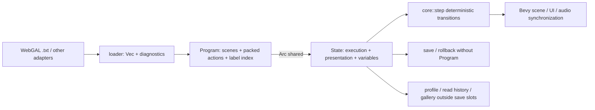

# 高性能内部格式与状态

## 目标

内部格式必须同时满足四个约束：

- 长脚本不能放大每次状态 clone、rollback 或 save 的成本；
- 场景与 label 跳转应稳定且接近 O(1)；
- core 不依赖 WebGAL、Bevy 或存储后端，loader 负责语法适配；
- 热重载与存档恢复不能把其他 Program 的过期脚本位置重新注入当前项目。

## 当前结构

### `Program`

实现位置：[`crates/core/src/model/action.rs`](../../../crates/core/src/model/action.rs)。

- `Program` 持有 `HashMap<String, Scene>`；每个 `Scene` 将动作压成 `Box<[Action]>`，构建完成后不再保留多余容量。
- label 在 `Scene::new` 时一次性建立 `HashMap<String, usize>` 索引，运行时不扫描 Action 列表。
- `Program::from_scenes` 在构建完成后计算一次内容 fingerprint；`Program::insert_scene` 会在替换场景后重算整个 fingerprint。
- 已安装的 `Program` 通过 `Arc` 按不可变方式查询。构建器、测试和增量工具仍可调用 `Program::insert_scene`；`State::insert_scene` 使用 `Arc::make_mut` 做 copy-on-write。生产热重载安装完整新 Program，运行时不会原地修改当前共享脚本。

### `State`

实现位置：[`crates/core/src/model/state.rs`](../../../crates/core/src/model/state.rs)。

| 状态类别 | 当前表示 | 存档/快照策略 |
|---|---|---|
| 不可变脚本 | `Arc<Program>` | `serde(skip)`；clone 只增加引用计数 |
| 脚本身份 | `program_fingerprint: u64` | 持久化；恢复前必须与当前 Program 完全相等 |
| 执行位置 | scene、cursor、scene stack、ended | 持久化；通过 fingerprint 门控后再协调 |
| 舞台计算态 | bg、sprites、transform、animation、transition、filter | 需要存档；rollback 保存可恢复子集 |
| 对话/交互 | dialogue、menu、textbox、intro、input | 需要按阻塞点恢复 |
| 音频持久态 | bgm、looping effects | 存档；一次性 cue 不持久化 |
| 瞬时事件 | `effect_queue` | `serde(skip)`，由呈现层消费后清空 |
| Backlog | 文本、位置、可恢复舞台子集、snapshot fingerprint | 持久化；只保留属于当前 Program 的条目 |
| 用户长效数据 | global vars、read history、gallery unlocks | `serde(skip)`，与单槽 save/rollback 分开持久化 |

`step()` 在一次调用开头只 clone 一次 `Arc<Program>`，随后直接借用当前 `&Action`。Action 中的字符串、Choice 列表和动画 payload 不再为了分派整条深拷贝；只有真正写入 runtime state 的字段才 clone。这样热循环的脚本访问成本不再随单条 Action payload 大小放大。

### Program fingerprint 与恢复门控

fingerprint 的实现位于 [`crates/core/src/model/action.rs`](../../../crates/core/src/model/action.rs)，用途是判断两个运行状态是否由同一份 typed Program 产生，而不是提供加密认证。

计算过程如下：

1. 空 Program 特判为 `0`。
2. 收集全部 scene name 并排序，消除 `HashMap` 迭代顺序的不确定性。
3. 按 scene name 顺序，将 `(scene name, &[Action])` 以当前 typed Serde schema 的 Postcard byte stream 直接写入 64-bit FNV-1a writer；不会先建立另一份完整序列化缓冲区。
4. label index 不单独参与 hash，因为它完全由 Action 中的 `Label` 派生。

因此相同 scene/action 内容不受插入顺序影响，scene 名、Action 顺序或 typed payload 改变都会改变 fingerprint。它仍然只是 64-bit 兼容性身份：存在理论碰撞，也不能防止恶意篡改；存档完整性由存档层的 CRC 负责。Action 的 Serde schema 若有意改变，也应视为内部格式变更。

fingerprint 在运行态中的约束是：

- 可执行 `State` 的 `program_fingerprint` 必须等于其 `Arc<Program>::fingerprint()`；`install_program` 和增量 `insert_scene` 都会同步这两个值。
- `record_dialogue` 创建的每个 `RollbackSnapshot` 都记录当时的 fingerprint。
- `State::restore_saved` 首先比较 saved/current fingerprint。不同则返回 `RestoreError::ProgramMismatch`，且在返回前不会替换 State、移动 profile map 或修改当前 Program，因而拒绝是原子的。
- 只有 fingerprint 相等后，saved Program 才会重新绑定到当前 `Arc<Program>`，并协调 saved cursor、scene frames 与 backlog。不同 Program 的存档位置绝不会被“夹紧后凑合恢复”。
- 同 fingerprint 的异常位置会被安全协调：cursor 夹紧到 scene 长度，失效 call frame 被移除；当前 scene 失效时尝试最近的有效 caller，最终没有有效 scene 则清空位置并标记结束。
- backlog 条目还必须让 snapshot fingerprint 等于当前 fingerprint，且 snapshot scene 必须存在并非空场景；通过后才会夹紧 snapshot cursor/frame 并规范化 dialogue key。

热重载当前运行态是另一条明确路径：`install_program` 先安装新 Program 并同步新 fingerprint，再把**当前** cursor/frame 协调到新 Program；旧 backlog snapshot 因 fingerprint 不同会整体失效。这样可以尽量保留正在运行的位置，但不会把旧脚本的回滚检查点迁移到新脚本。

### `TransformPatch`

实现位置：[`crates/core/src/model/types.rs`](../../../crates/core/src/model/types.rs)、[`crates/loader/src/adapter/script/webgal.rs`](../../../crates/loader/src/adapter/script/webgal.rs) 和 [`crates/core/src/runtime/step.rs`](../../../crates/core/src/runtime/step.rs)。

WebGAL `setTransform` 是稀疏更新：命令没有写出的字段必须继承目标当前值。`TransformPatch` 用一个 `u8` presence mask 表示 7 个基础字段是否出现，数值仍紧凑存放在 `SpriteTransform` 中。

- 固定大小为 32 bytes，小于 7 个 `Option<f32>` 的直观实现开销；
- `apply_to` 是无分配、常数时间的按位覆盖；
- “缺失”与“显式 0”不同，因此 `blur:0`、`rotation:0` 能真正清除旧值；
- loader 对 JSON 和键值写法都只设置实际出现字段；
- core 以当前 transform 为 from，以 patch 应用结果为 to，动画中途不会重置其他属性；
- 未写 `duration` 时采用 WebGAL 默认 500 ms，显式 `-duration=0` 才立即应用。

当前 patch 只覆盖 position、alpha、scale、rotation、blur。完整 WebGAL filter、`writeDefault` 和 `keep` 仍是兼容缺口。

### Player profile 分离

实现位置：[`src/storage.rs`](../../../src/storage.rs) 和 [`crates/core/src/model/state.rs`](../../../crates/core/src/model/state.rs)。

- `global_vars` 使用版本化 Postcard 文件 `saves/profile.bin`，不进入任何单槽 save。
- runtime 变化经过 0.5 秒 debounce 合并写盘，正常退出时强制 flush。
- `restore_saved` 在 fingerprint 通过后保留当前 Program、global profile、read history 和 gallery unlocks，只恢复槽内剧情状态。
- RollbackSnapshot 不包含 global vars，因此 Backlog 回想不会倒退长期进度。
- 删除游戏槽保留 profile；“清除所有数据”显式删除 profile；备份导入/导出会携带整个 `saves/` 下的 profile。

这让“长期玩家进度”和“某个剧情时间点”拥有不同的恢复语义，避免读旧档撤销新解锁或周目变量。

### Save v8 与 `SavedState`

实现位置：[`crates/loader/src/adapter/store.rs`](../../../crates/loader/src/adapter/store.rs)。

当前 `.sav` 是明确版本化的二进制 envelope，而不是裸 `State`：

| 偏移 | 大小 | 内容 |
|---:|---:|---|
| 0 | 8 bytes | magic `CRABGAL\0` |
| 8 | 4 bytes | little-endian version，当前为 `8` |
| 12 | 4 bytes | Postcard metadata 长度 |
| 16 | 4 bytes | Postcard state 长度 |
| 20 | 4 bytes | metadata payload 的 CRC32 |
| 24 | 4 bytes | state payload 的 CRC32 |
| 28 | metadata length | `saved_at_unix`、program fingerprint、scene、cursor、speaker、text |
| 后续 | state length | Postcard `State` payload；`Program` 和 profile-scoped 字段由 Serde 跳过 |

读取时会验证 magic、版本和两个非零长度上限（metadata 64 KiB、state 64 MiB）。槽位列表的 `inspect` 只读取 28-byte header 与实际 metadata，并校验 metadata CRC；`decode` 才读取完整文件、核对总长度与 state CRC 并反序列化剧情状态。两个 CRC 都用于发现损坏，不是安全签名。

`decode` 返回 `SavedState`，而不是可直接执行或覆盖当前 runtime 的公开 `State`。其内部 Program 因 `serde(skip)` 为空，但保存的 fingerprint 仍在；`snapshot()` 只提供预览读取，真正恢复必须消费 `SavedState` 并调用 `restore_into(&mut current)`。该方法转入 `State::restore_saved`，统一执行 fingerprint 等值门控、当前 Program 重绑定和 profile 保留，避免调用方绕过不变量。

v8 不尝试兼容旧二进制布局：未知版本由 `inspect` 报告 `Unsupported(version)`，`decode` 直接拒绝。固定时间戳生成的 [`store-v8.sav`](../../../crates/loader/tests/fixtures/store-v8.sav) 由 `save_v8_golden_is_stable` 逐 byte 比较；只有有意升级格式时才应使用 `CRABGAL_UPDATE_STORE_GOLDEN=1` 重建 fixture，并同步评估是否需要增加版本号。v8 扩展了 LetsGal 1.8.0 相机后处理状态；舞台时间轴属于瞬态演出，恢复时会被清理而不会持久化。这次显式升版，避免新字段被旧布局误读。

### Loader 与热重载

实现位置：[`crates/loader/src/loader/scenes.rs`](../../../crates/loader/src/loader/scenes.rs) 和 [`crates/core/src/model/state.rs`](../../../crates/core/src/model/state.rs)。

- script 目录递归扫描并稳定排序，嵌套相对路径成为 scene key，避免同名文件静默碰撞。
- 多内容源按稳定优先级合并，覆盖会产生诊断。
- 文件系统递归扫描先固定 canonical mount root，按 `DirEntry::file_type` 遍历，并用 canonical directory identity 阻止 symlink cycle；指向挂载根之外的链接不会成为内容。
- Hexz 挂载在打开包时建立共享文件/目录 index，递归枚举只过滤一次 archive index，不再对每个子目录重复扫描整个包。
- `State::install_program` 替换共享 Program、同步 fingerprint、移除失效 call frame，并把当前 cursor 夹紧到新场景边界；属于旧 fingerprint 的 backlog 会被删除。
- 开发期 watcher 安装新 Program 时不会把旧对白、Choice、输入框或动画直接挂到新 fingerprint 上；它会清理旧演出/交互/已读位置，从当前 scene 的开头重新执行，并保留 local/global variables 与鉴赏解锁。
- `SavedState::restore_into` 是存档进入运行态的唯一 loader API；只有 fingerprint 相同才会继续协调位置并恢复槽内剧情状态。若同 fingerprint 的 payload 含异常位置，会恢复到最近仍有效的 caller；没有任何有效 scene 时清空位置并安全结束。

### CLEAR ALL 生命周期

实现位置：[`src/storage.rs`](../../../src/storage.rs)。

`reset_all` 不逐个猜测文件名，而是删除项目整个 `saves/` 运行时数据目录，并同步清空 settings、profile、read history、gallery 与各 writer cache 的内存镜像。操作可重复调用；下一次正常原子写入会按需重建目录，因此旧 cache 不会在下一帧把已经清除的数据写回来。

## 复杂度

以下记号用于区分真正的热路径与构建/持久化成本：`S` 为 scene 数，`A` 为 Action 数，`L` 为 label 数，`P` 为 fingerprint 输入的 Postcard byte 数，`M` 为序列化 metadata byte 数，`R` 为序列化 runtime state byte 数，`F` 为当前 call frame 数，`B` 为 backlog 条目数，`Fᵢ` 为第 i 个 backlog snapshot 的 frame 数。

| 操作 | 当前复杂度 | 说明 |
|---|---:|---|
| clone `State` 的脚本部分 | O(1) | 仅 clone `Arc<Program>`；与 Action 总数无关 |
| clone 完整 `State` | O(runtime state) | sprites、vars、backlog 等仍会复制；不能把脚本部分 O(1) 误写成整个 State O(1) |
| serialize/deserialize 存档 | O(R) | Program 不进入存档，大小与脚本总量无关 |
| `inspect` 存档 | O(M) time / O(M) temporary bytes | 只读取 28-byte header 与 metadata，不读取或哈希 state payload |
| fingerprint 不匹配的恢复 | O(1) | 比较两个 `u64` 后原子拒绝，不遍历 saved cursor/frame/backlog |
| fingerprint 匹配的恢复协调 | O(F + B + ΣFᵢ) | 平均 O(1) scene 查询；夹紧当前位置并逐条验证 backlog snapshot |
| scene 查询 | 平均 O(1) | scene map |
| label 跳转 | 平均 O(1) | 构建期 label index |
| `step()` Action 读取 | O(1) | 每次调用 clone 一个 Program Arc，Action payload 借用分派；不含该 Action 自身语义工作 |
| 应用 `TransformPatch` | O(1) | 7 个 presence bit、无 heap allocation |
| 构建完整 Program | O(A + L + S log S + P) | 建 label index、排序 scene name，并将全部 typed Action 流式送入 fingerprint |
| 增量 `insert_scene` | O(new actions + new labels + S log S + P) | scene 替换本身局部，但当前实现会重算整个 Program fingerprint；不应放在逐帧热路径 |
| 安装/协调 Program | O(F + B + ΣFᵢ) | Arc 替换；当前 cursor/frame 协调，旧 fingerprint backlog 被过滤 |
| rollback 快照 | O(snapshot runtime state) | 复制 sprites、local vars、stack、音频/transition 等可恢复域；Program 只记录一个 `u64` fingerprint |

这里的 O(1) 是平均哈希查询复杂度，不承诺硬实时上界。

## 必须保持的状态不变量

1. 可执行 `State` 必须满足 `state.program_fingerprint == state.program.fingerprint()`。刚 decode 的 `SavedState` 不是可执行 State：它有持久化 fingerprint，但 Program 为空，只能通过 `restore_into` 进入 runtime。
2. 从存档带来的 current cursor、scene frame 和 backlog 只允许在 saved/current fingerprint 相等后协调；不允许把不同 Program 的位置夹紧后继续运行。
3. fingerprint 不匹配时 `restore_saved` 必须在任何状态移动或修改之前返回 `ProgramMismatch`；当前 Program、执行态和 profile 都保持逐值不变。
4. 当前 scene 有效时满足 `cursor <= current_scene.len()`；没有任何有效 scene 的合法终态是空 scene、cursor=0、ended=true。
5. scene stack 中每个保留的 frame 都引用当前 Program 中存在的场景，且 `frame.cursor <= scene.len()`。
6. 每个可恢复 backlog snapshot 的 fingerprint 必须等于当前 fingerprint；其 scene 必须存在且非空，cursor/frame 必须经过边界协调。安装不同 fingerprint 的 Program 会丢弃旧 backlog，而不是迁移它。
7. Program 不进入 save、rollback snapshot 或 gallery/read-history 文件；save 大小不得随 Action 总数增长。
8. global profile、read history 和 gallery unlocks 不得被单槽 load 或 Backlog rollback 覆盖。
9. 一次性音效、输入事件、GPU handle、Entity 等呈现层对象不得进入 core 持久状态。
10. core state 是确定性计算态；Bevy Entity 只是该状态的投影，不能成为脚本语义的唯一真相。
11. loader 必须保留 source span 和诊断，不能为了压缩 Action 丢失发布前错误定位能力。

## 仍可优化的热点

### 1. Rollback 增量化

当前每条 backlog checkpoint 会复制 sprites、局部变量和场景栈；global profile 已经从 snapshot 移除。项目拥有大量自由立绘或局部变量时，这部分仍会成为主要成本。下一步可使用按版本共享的 `Arc` map，或以“基准快照 + 有界 delta”保存变更；必须先用实际大场景基准证明收益，不能仅按理论结构替换。

ProfileWriter 当前也会在同步周期比较 global variable map。若大型项目出现数千个全局变量，应改为 revision/dirty flag 驱动；在有代表性 profile 规模之前，不为理论收益增加另一套可变状态协议。

### 2. 字符串与资源标识符驻留

`Action` 和 `State` 仍重复保存 scene、asset、target、variable 名称。可在 Program 构建期引入 `SceneId`、`LabelId`、`AssetId` 和 interned symbol，运行时只保存紧凑整数。边界层仍需保留原始字符串用于诊断、热重载映射和存档迁移。

### 3. Typed command payload

当前 `Action` 已经是 typed IR，transform 也已改为紧凑 presence-mask patch；animation 仍包含字符串 custom preset 和宽 keyframe 需求。未来可把解析后的 target、资源种类和 animation keyframe 编译为紧凑 payload，避免每帧字符串判断；不应把 WebGAL 专有参数泄漏回 core 公共 API。

### 4. 状态域分离

`PersistentUserData` 已经在存储与恢复语义上同单槽 save 分离；内存中的 `State` 仍可进一步拆成 `ExecutionState`、`StageState`、`InteractionState` 和 `AudioState`，让 renderer 按 revision/dirty bit 只同步受影响的域。拆分必须保持单步状态迁移的原子性，不能让 UI 看见半提交状态。

## 推荐基准

至少覆盖以下四种脚本形状：

| 场景 | 规模 | 观测指标 |
|---|---:|---|
| 长线性剧情 | 100k Action、少量 label | Program 构建时间、State clone、save 大小 |
| 分支密集 | 10k label/jump、100 个 scene | label/scene 跳转延迟、热重载安装时间 |
| 舞台密集 | 100 sprites、1k local vars、200 backlog | rollback 生成/恢复时间、峰值内存 |
| 连续 transform | 100k sparse patches、显式零与动画混合 | patch apply、Action 大小、未写字段正确性 |

性能验收应同时检查行为：同名 label 选择规则、嵌套 callScene 返回、热重载游标夹紧、fingerprint 不匹配存档的原子拒绝、匹配存档恢复后仍使用当前 Program/当前 profile、稀疏 transform 不重置字段，以及缺失 scene 的可定位诊断。
